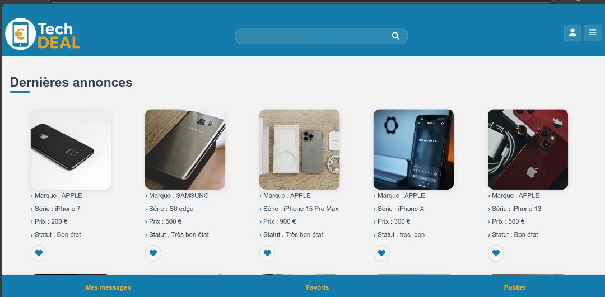
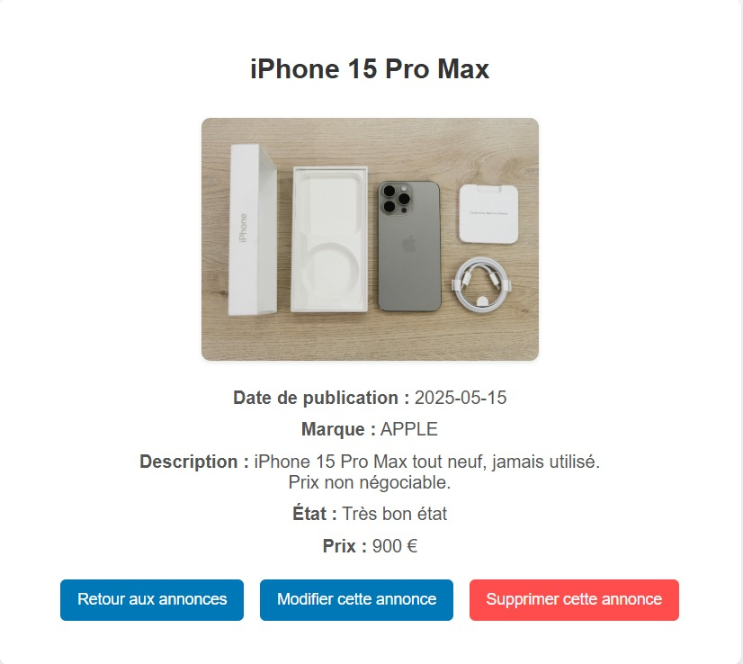
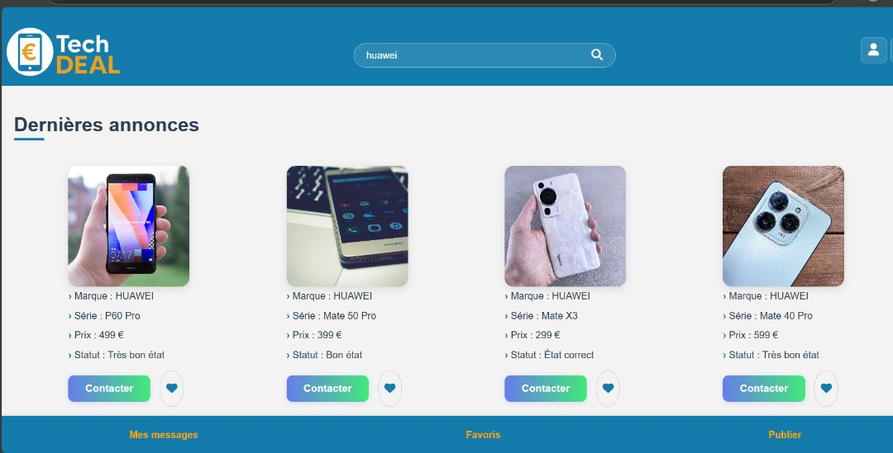
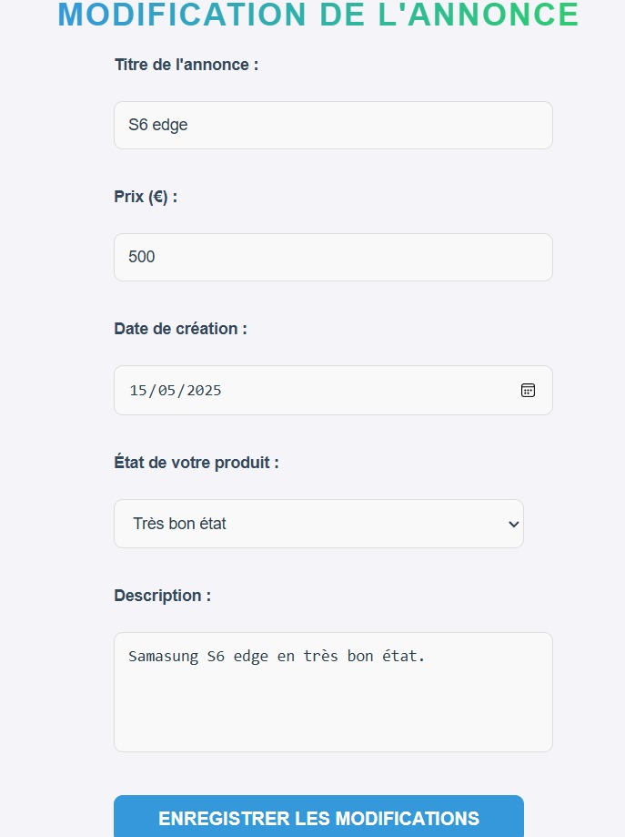

# TechDEAL

## Description

TechDEAL est une plateforme de petites annonces spécialisée dans les smartphones d'occasion. Le projet a été développé dans le cadre d'un projet de développement web afin de mettre en pratique la création d'une application complète avec gestion des utilisateurs, des annonces et d'une base de données.

## Technologies utilisées

- HTML
- CSS
- JavaScript
- Node.js
- Express.js
- MySQL

## Fonctionnalités

- Inscription et connexion des utilisateurs
- Publication d'annonces de smartphones
- Modification et suppression d'annonces
- Gestion du profil utilisateur
- Affichage dynamique des annonces
- Mode sombre
- Sélection de langue
- Interface responsive

## Captures d'écran

### Capture 1

### Capture 2

### Capture 3

### Capture 4

### Capture 5

### Capture 6

### Capture 7

### Capture 8

### Capture 9

## Auteur

Mouhammad Sissoko
